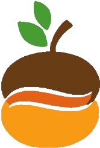

  <h1 align='center'> Saudações, sou Kawan Nascimento da Silva! </h1>
  
  <h3 align='center'> Sobre mim e pretextos </h3>
  
 Desde 2020 explorando o mundo de TI (Tecnologia da Informação) e suas diversas áreas, de personalização de sites, desenvolvimento da logica dos softwares, criação de aplicativos,
    manipulação de banco de dados até analista de sistemas, sendo as minhas principais hard skills, além das soft skills como produtividade, proatividade, compromisso com a organização,
    planejamento, negociador e brainstormer, não pretendo parar tão cedo a continuar nos aprendizados e fortalecer-me nos desafios, espero agregar com o meu oferecimento destas
    habilidades vitais, cumprir metas e promover uma mudança positiva ao conjunto empresarial. 

  
    

> <h3> Atualmente atuando no projeto Nósz: Comida para o nosso povo! </h3>  

  

  <h3> Instituições, plataformas e programas nos quais adquiri conhecimento </h3>

   |  |  |  |  | 
-------- | ----------------------- | ----------------------- | ----------------------- | ----------------------- | -----------------------
  
  

  
  <h3> Linguagens, tecnologias e frameworks </h3>
  <h5> Em estudo/básico </h5>
  
  <h5> Estudos aprofundados/avançado </h5>
  
  
  

  
  <h3> Estatísticas </h3>
  
  
  
  

  
  <h3> Contatos </h3>
  
  
  
  
  

